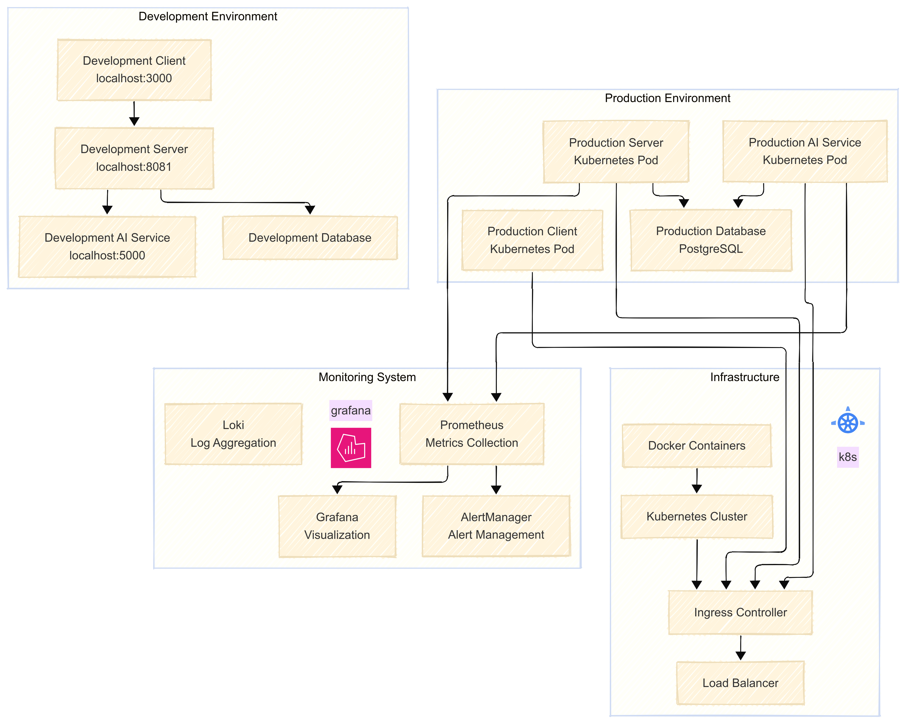
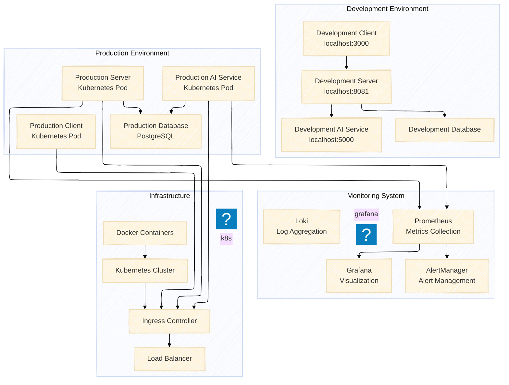

# Team RoboGo System Architecture Diagrams (Mermaid)

## High-Level System Architecture Visualization

*High-level system architecture showing the complete layered structure from client to infrastructure*

## 1. High-Level System Architecture

## 2. Detailed Component Architecture

*Detailed component architecture showing frontend, backend, AI services, and data storage relationships*

## 4. Real-time Synchronization Architecture

## 5. Deployment Architecture

## Technology Stack Summary

### Frontend Technology Stack
- **Framework**: Vue.js 3 (Composition API)
- **UI Library**: Tailwind CSS
- **State Management**: Pinia
- **Build Tool**: Vite
- **Testing**: Vitest

### Backend Technology Stack
- **Framework**: Spring Boot 3.x
- **Database**: PostgreSQL
- **Cache**: Redis
- **Authentication**: JWT
- **Documentation**: Swagger-UI

### AI Service Technology Stack
- **Framework**: FastAPI (Python)
- **ML Libraries**: Based on requirements
- **Communication**: REST APIs

### Infrastructure Technology Stack
- **Containerization**: Docker
- **Orchestration**: Kubernetes
- **Monitoring**: Prometheus, Grafana, Loki
- **CI/CD**: GitHub Actions

This architecture provides a robust foundation for the Team RoboGo system, ensuring scalability, reliability, and maintainability while supporting the specific requirements of robotics competition management. 