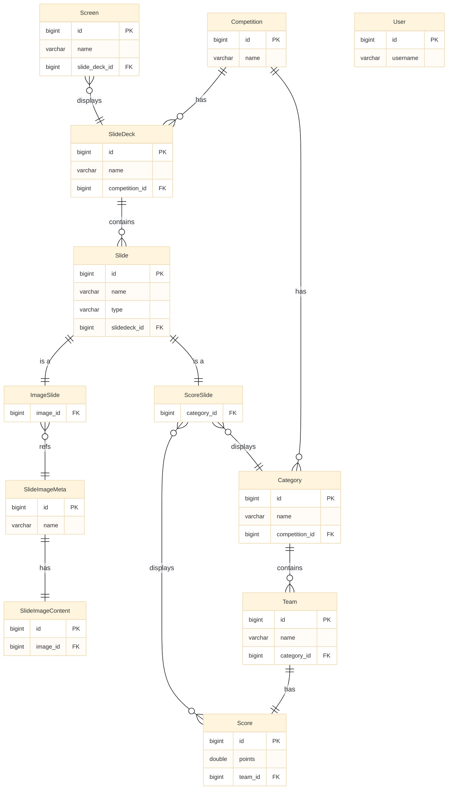

# Database Entity Relationship Diagram (ER Diagram)

## Mermaid ER Diagram

## Entity Descriptions

### Core Entities

1. **Competition**
   - Top-level entity representing a competition event
   - Contains multiple slide decks and categories

2. **SlideDeck**
   - Collection of slides
   - Supports version control and synchronization mechanisms
   - Belongs to a specific competition

3. **Slide**
   - Abstract base class using single table inheritance
   - Distinguished by type field (IMAGE/SCORE)
   - Has fixed order within slide deck

### Slide Types

4. **ImageSlide**
   - Inherits from Slide
   - Displays image content
   - Associated with SlideImageMeta

5. **ScoreSlide**
   - Inherits from Slide
   - Displays scores for specific category
   - Associated with Category

### Image Management

6. **SlideImageMeta**
   - Stores basic image information
   - One-to-one relationship with SlideImageContent

7. **SlideImageContent**
   - Stores actual image binary data
   - One-to-one relationship with SlideImageMeta

### Competition Management

8. **Category**
   - Categories within a competition
   - Contains multiple teams
   - Belongs to specific competition

9. **Team**
   - Belongs to specific category
   - Has unique score record

10. **Score**
    - Unique score record for team
    - Contains points and time
    - One-to-one relationship with Team

### System Management

11. **Screen**
    - Display device
    - Can display specific slide deck
    - Has online/offline status

12. **User**
    - System user
    - Used for authentication and authorization

## Key Features

- **Inheritance**: Slide uses single table inheritance, distinguished by type field
- **Version Control**: SlideDeck supports version control for multi-client synchronization
- **Unique Constraints**: Score-Team and SlideImageContent-SlideImageMeta are one-to-one relationships
- **Cascade Operations**: Multiple relationships support cascade delete and update
- **Lazy Loading**: Most many-to-one relationships use lazy loading for performance optimization

## Database Constraints

- **Unique Constraints**: 
  - `internal_id` in Competition table
  - `username` in User table
  - `team_id` in Score table (one-to-one with Team)
  - `image_id` in SlideImageContent table (one-to-one with SlideImageMeta)
  - `(slidedeck_id, index)` in Slide table (unique slide order per deck) 