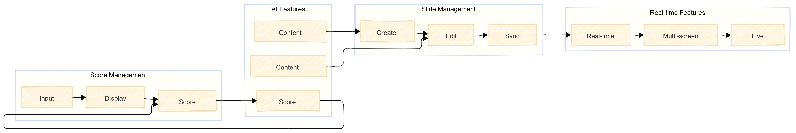

# Software Requirements Specification

## Project Overview

Team RoboGo is a multi-screen presentation and score management system designed for robotics competitions. The system enables real-time synchronization of slide presentations across multiple display screens while providing comprehensive score tracking and team management capabilities.

## Main Feature Modules

*Functional architecture showing the four core feature modules: Score Management, AI Features, Slide Management, and Real-time Features with their interconnections*

## 1. Functional Requirements

### 1.1 Score Management Module
The system provides comprehensive score tracking and management capabilities:
- **Input**: Score entry and validation for team performances
- **Display**: Real-time score visualization and ranking
- **Analysis**: Score processing and statistical analysis
- **Feedback Loop**: Continuous score updates and processing

### 1.2 AI Features Module
AI-powered content generation and analysis capabilities:
- **Content Generation**: AI-driven slide content creation
- **Score Analysis**: AI-powered score prediction and analysis
- **Content Optimization**: AI-based content enhancement for different screen sizes
- **Integration**: Seamless integration with slide management and score systems

### 1.3 Slide Management Module
Complete slide deck creation and management system:
- **Create**: Slide creation with AI-generated content
- **Edit**: Slide modification and content updates
- **Sync**: Real-time synchronization across all displays
- **Content Flow**: Integration with AI features for content generation

### 1.4 Real-time Features Module
Real-time display and synchronization capabilities:
- **Real-time Sync**: Immediate content updates across all screens
- **Multi-screen Display**: Simultaneous display on multiple screens
- **Live Updates**: Continuous real-time content streaming
- **Integration**: Seamless connection with slide management system

### 1.5 User Authentication and Authorization
- **FR-1.1**: System shall provide user login functionality with username and password
- **FR-1.2**: System shall generate and validate JWT tokens for authenticated sessions
- **FR-1.3**: System shall support session validation and logout functionality
- **FR-1.4**: System shall protect API endpoints requiring authentication

### 1.6 Slide Deck Management
- **FR-2.1**: System shall allow creation of slide decks with configurable transition times
- **FR-2.2**: System shall support two types of slides: Image slides and Score slides
- **FR-2.3**: System shall enable adding, updating, and deleting slides within decks
- **FR-2.4**: System shall maintain slide order and indexing within decks
- **FR-2.5**: System shall support image upload and storage for image slides

### 1.7 Real-time Synchronization
- **FR-3.1**: System shall implement version control for slide decks
- **FR-3.2**: System shall support polling-based synchronization mechanism
- **FR-3.3**: System shall detect changes and notify all connected screens
- **FR-3.4**: System shall ensure all screens display identical content simultaneously
- **FR-3.5**: System shall handle network interruptions gracefully

### 1.8 Score Management
- **FR-4.1**: System shall allow recording team scores with points and completion time
- **FR-4.2**: System shall support score updates and modifications
- **FR-4.3**: System shall provide score ranking and sorting capabilities
- **FR-4.4**: System shall display scores in real-time on score slides

### 1.9 Team and Category Management
- **FR-5.1**: System shall support team creation and management
- **FR-5.2**: System shall allow categorization of teams
- **FR-5.3**: System shall maintain team-category relationships
- **FR-5.4**: System shall support competition organization

### 1.10 Screen Management
- **FR-6.1**: System shall allow registration and management of display screens
- **FR-6.2**: System shall support screen status monitoring (active, inactive, error)
- **FR-6.3**: System shall enable assignment of slide decks to screens
- **FR-6.4**: System shall provide screen content control

### 1.11 Image Management
- **FR-7.1**: System shall support image upload with metadata storage
- **FR-7.2**: System shall store image content separately from metadata
- **FR-7.3**: System shall support various image formats (JPEG, PNG, GIF)
- **FR-7.4**: System shall provide image retrieval and display capabilities

## 2. Non-Functional Requirements

### 2.1 Performance Requirements
- **NFR-1.1**: System shall respond to API requests within 500ms for 95% of requests
- **NFR-1.2**: System shall support concurrent access from at least 10 screens
- **NFR-1.3**: System shall handle image uploads up to 100MB per file
- **NFR-1.4**: System shall maintain synchronization latency under 2 seconds

### 2.2 Reliability Requirements
- **NFR-2.1**: System shall have 99.5% uptime during competition periods
- **NFR-2.2**: System shall gracefully handle network interruptions
- **NFR-2.3**: System shall provide data backup and recovery mechanisms
- **NFR-2.4**: System shall prevent data loss during synchronization

### 2.3 Security Requirements
- **NFR-3.1**: System shall encrypt sensitive data in transit and at rest
- **NFR-3.2**: System shall implement secure JWT token management
- **NFR-3.3**: System shall prevent unauthorized access to API endpoints
- **NFR-3.4**: System shall validate all input data to prevent injection attacks

### 2.4 Usability Requirements
- **NFR-4.1**: System shall provide intuitive API documentation via Swagger UI
- **NFR-4.2**: System shall support multiple languages (English and German)
- **NFR-4.3**: System shall provide clear error messages and status codes
- **NFR-4.4**: System shall be accessible via standard web browsers

### 2.5 Scalability Requirements
- **NFR-5.1**: System shall support multiple competitions simultaneously
- **NFR-5.2**: System shall handle increasing number of teams and categories
- **NFR-5.3**: System shall support horizontal scaling of services
- **NFR-5.4**: System shall maintain performance with growing data volume

## 3. System Constraints

### 3.1 Technical Constraints
- System must be compatible with Java 17 or higher
- System must use PostgreSQL as the primary database
- System must support Docker containerization
- System must provide RESTful API interfaces

### 3.2 Operational Constraints
- System must operate in competition environments with limited network bandwidth
- System must function with intermittent internet connectivity
- System must support rapid deployment and configuration changes
- System must provide monitoring and logging capabilities

### 3.3 Business Constraints
- System must comply with data protection regulations
- System must support competition-specific scoring rules
- System must provide audit trails for score modifications
- System must enable quick setup for new competitions

## 4. Acceptance Criteria

### 4.1 Functional Acceptance Criteria
- All API endpoints return correct responses for valid requests
- Authentication system properly validates user credentials
- Slide deck synchronization works across all connected screens
- Score management accurately tracks and displays team scores
- Image upload and display functionality works correctly

### 4.2 Non-Functional Acceptance Criteria
- System responds within specified performance thresholds
- Security measures prevent unauthorized access
- System remains stable during extended operation
- Documentation is complete and accurate
- System can be deployed using provided Docker configuration

## 5. Risk Analysis

### 5.1 Technical Risks
- **Risk**: Network connectivity issues during competitions
  - **Mitigation**: Implement robust error handling and retry mechanisms
- **Risk**: Database performance degradation with large datasets
  - **Mitigation**: Implement proper indexing and query optimization
- **Risk**: Security vulnerabilities in authentication system
  - **Mitigation**: Regular security audits and JWT best practices

### 5.2 Operational Risks
- **Risk**: User training and adoption challenges
  - **Mitigation**: Provide comprehensive documentation and training materials
- **Risk**: System downtime during critical competition periods
  - **Mitigation**: Implement monitoring and alerting systems
- **Risk**: Data loss or corruption
  - **Mitigation**: Regular backups and data validation

## 6. Traceability Matrix

| Requirement ID | Component | Status | Priority |
|----------------|-----------|--------|----------|
| FR-1.1 | AuthController | Implemented | High |
| FR-1.2 | JwtService | Implemented | High |
| FR-2.1 | SlideDeckController | Implemented | High |
| FR-2.2 | Slide entities | Implemented | High |
| FR-3.1 | SlideDeck version field | Implemented | High |
| FR-3.2 | SyncService | Implemented | High |
| FR-4.1 | ScoreController | Implemented | High |
| FR-5.1 | TeamController | Implemented | Medium |
| FR-6.1 | ScreenController | Implemented | Medium |
| FR-7.1 | SlideImageController | Implemented | Medium |

This requirements specification provides a comprehensive foundation for the Team RoboGo system development and serves as a reference for all stakeholders involved in the project. 