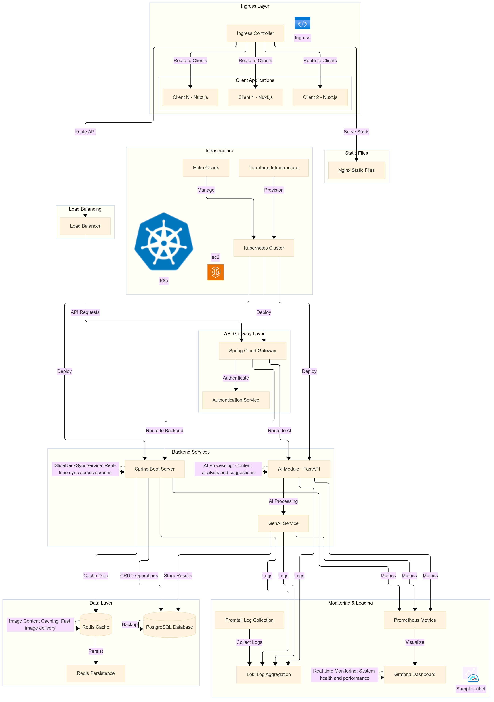
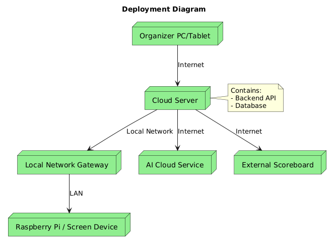
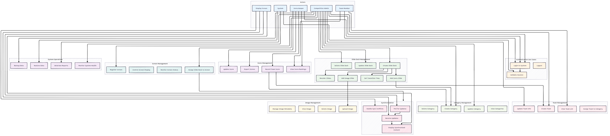
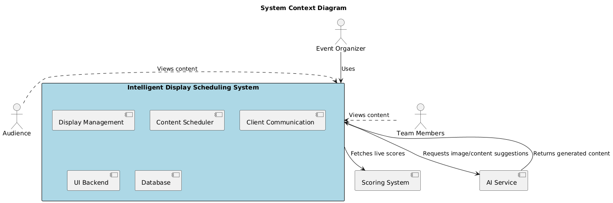

# Top-Level Architecture

## System Overview

Team RoboGo is a distributed system designed for multi-screen presentation and score management in robotics competitions. The architecture follows a microservices pattern with clear separation of concerns and real-time synchronization capabilities.

## Architecture Diagram

*High-level system architecture showing client, gateway, services, and infrastructure layers*

## Component Architecture

*Component architecture showing presentation, API, business logic, and data access layers*

## Deployment Architecture

*Deployment architecture showing development, Docker, and production environments*

## Data Flow Architecture

*Data flow architecture showing client-server communication, caching, and AI integration*

## Security Architecture

*Security architecture showing client, API, and data security layers*

## Real-time Synchronization Architecture

*Real-time synchronization architecture showing screen polling and version control*

## Key Architectural Principles

### 1. Separation of Concerns
- Clear separation between presentation, business logic, and data layers
- Modular design with well-defined interfaces
- Independent deployment of services

### 2. Scalability
- Horizontal scaling support through containerization
- Stateless service design
- Efficient caching mechanisms

### 3. Reliability
- Fault tolerance through retry mechanisms
- Graceful degradation during network issues
- Comprehensive error handling

### 4. Security
- JWT-based authentication
- Input validation and sanitization
- Secure communication protocols

### 5. Maintainability
- Comprehensive documentation
- Standardized API design
- Automated testing and deployment

## Technology Stack

### Frontend
- **Framework**: Vue.js 3 with Composition API
- **UI Library**: Tailwind CSS
- **State Management**: Pinia
- **Real-time**: WebSocket/Polling

### Backend
- **Framework**: Spring Boot 3.x
- **Database**: PostgreSQL
- **Cache**: Redis
- **Documentation**: SpringDoc OpenAPI

### Infrastructure
- **Containerization**: Docker
- **Orchestration**: Docker Compose / Kubernetes
- **Monitoring**: Prometheus, Grafana, Loki

### AI Integration
- **Framework**: FastAPI (Python)
- **ML Libraries**: Based on requirements
- **Communication**: REST APIs

This architecture provides a robust foundation for the Team RoboGo system, ensuring scalability, reliability, and maintainability while supporting the specific requirements of robotics competition management. 